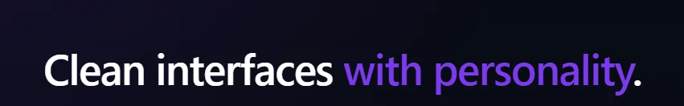

# Remy Lian — Course Portfolio



A dark-first, neon-accent portfolio showcasing my three required Noroff course projects, each presented with a short preview and a full article page.

## Description

This portfolio is designed to feel modern, sharp, and easy to navigate. The project deck acts as the main hub: pick a project from the table of contents, read a quick preview, and open the full article for a structured breakdown of what I built and what I learned.

Key features:

- **Project deck + table of contents** for quick navigation
- **Project previews** (short description) with links to full article pages
- **Article pages** with structured reflections (what I built, challenges, lessons learned, improvements)
- **Responsive layout** with a consistent dark/neon visual theme

## Built With

- [React](https://react.dev/)
- [TypeScript](https://www.typescriptlang.org/)
- [Vite](https://vitejs.dev/)
- [Tailwind CSS](https://tailwindcss.com/)
- [React Router](https://reactrouter.com/)

## Getting Started

### Installing

1. Clone the repo:

```bash
git clone https://github.com/remylian/Portfolio.git
```

2. Install the dependencies:

```bash
npm install
```

### Running

To run the app locally:

```bash
npm run dev
```

To build for production:

```bash
npm run build
```

To preview the production build:

```bash
npm run preview
```

## Contributing

This repository is primarily a course delivery. If you spot an issue or have suggestions:

1. Fork the repo
2. Create a feature branch
3. Open a pull request with a short explanation of the change

## Contact

- GitHub: [https://github.com/remylian](https://github.com/remylian)
- LinkedIn: [Linkedin](https://www.linkedin.com/in/remy-lian-585518a1/)
- Email: [remylian@gmail.com]

## Acknowledgments

- Noroff course briefs and assignment requirements
- Official documentation for React, TypeScript, Vite, and Tailwind CSS
